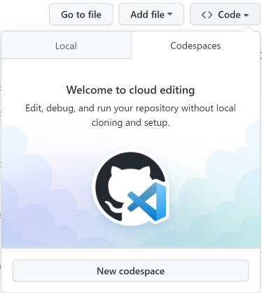
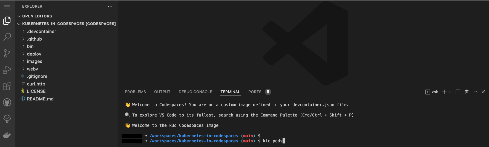
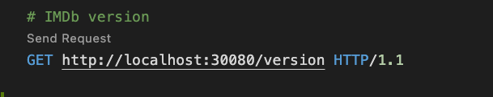
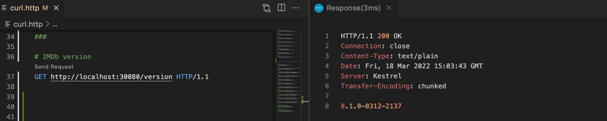
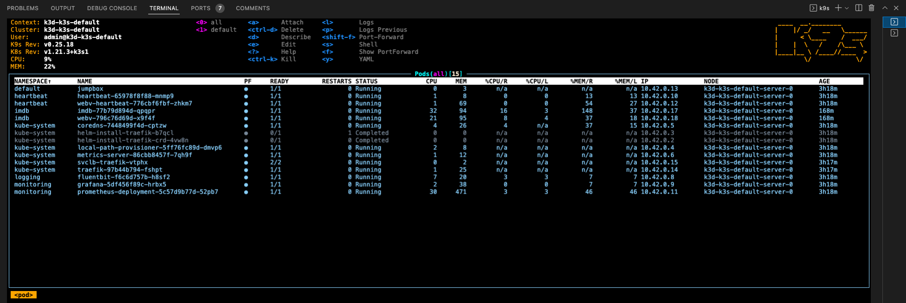
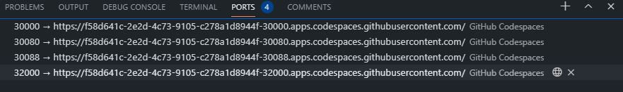
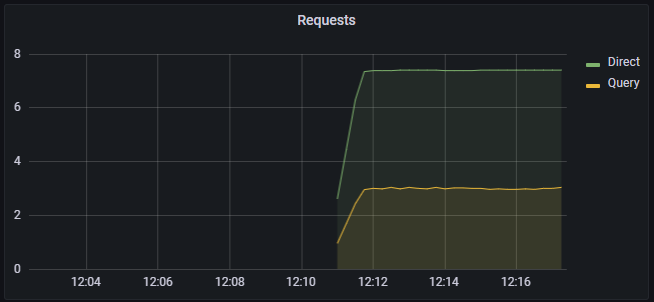
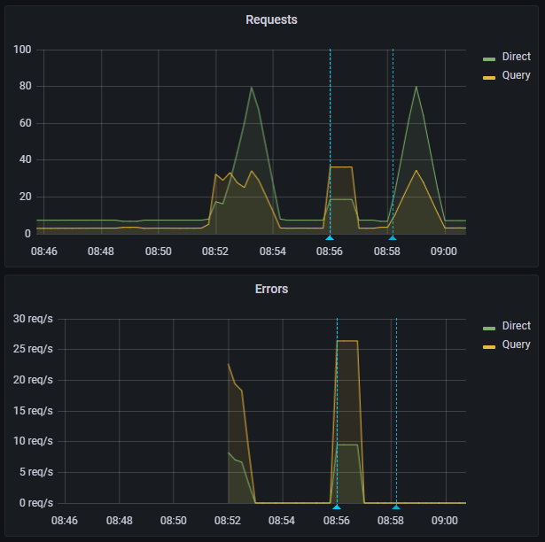

# Kubernetes in Codespaces

> Setup a Kubernetes cluster using `k3d` running in [GitHub Codespaces](https://github.com/features/codespaces)


## Overview

This is a template that will setup a Kubernetes developer cluster using `k3d` in a `GitHub Codespace`

We use this for `inner-loop` Kubernetes development. Note that it is not appropriate for production use but is a great `Developer Experience`. Feedback calls the approach `game-changing` - we hope you agree!

For ideas, feature requests, and discussions, please use GitHub discussions so we can collaborate and follow up.

This Codespace is tested with `zsh` and `oh-my-zsh`.

You can connect to the Codespace with a local version of VS Code.

Please experiment and add any issues to the GitHub Discussion.

The motivation for creating and using Codespaces is highlighted by this [GitHub Blog Post](https://github.blog/2021-08-11-githubs-engineering-team-moved-codespaces/). "It eliminated the fragility and single-track model of local development environments, but it also gave us a powerful new point of leverage for improving GitHub’s developer experience."

Cory Wilkerson, Senior Director of Engineering at GitHub, recorded a podcast where he shared the GitHub journey to [Codespaces](https://changelog.com/podcast/459)

## Join the CSE-Labs GitHub Org

> You must be a member of the Microsoft OSS and CSE-Labs GitHub organizations

- If you can't open a Codespace in this repo, you need to join the GitHub org(s)
  - Instructions for joining are [here](https://github.com/cse-labs/moss)
- Return to this repo after joining the org(s)

## Open with Codespaces

> You must be a member of the Microsoft OSS and CSE-Labs GitHub organizations

- Click the `Code` button on this repo
- Click the `Codespaces` tab
- Click `New Codespace`
- Choose the `4 core` option



## Stopping a Codespace

- Codespaces will shutdown automatically after being idle for 30 minutes
- To shutdown a codespace immediately
  - Click `Codespaces` in the lower left of the browser window
  - Choose `Stop Current Codespace` from the context menu

- You can also rebuild the container that is running your Codespace
  - Any changes in `/workspaces` will be retained
  - Other directories will be reset
  - Click `Codespaces` in the lower left of the browser window
  - Choose `Rebuild Container` from the context menu
  - Confirm your choice

- To delete a Codespace
  - <https://github.com/codespaces>
  - Use the context menu to delete the Codespace
  - Please delete your Codespace once you complete the lab
    - Creating a new Codespace only takes about 45 seconds!

## Checking the k3d Cluster

- A k3d cluster is created as part of the Codespace setup
  - `kic` is a small CLI that we use to simplify Kubernetes development

  ```bash

  # check the pods
  kic pods

  ```

- Output from `kic pods` should resemble this

  ```text

  NAMESPACE     NAME                                      READY   STATUS              RESTARTS   AGE
  kube-system   local-path-provisioner-5ff76fc89d-wfpjx   1/1     Running             0          48s
  kube-system   coredns-7448499f4d-dnjzl                  1/1     Running             0          48s
  kube-system   metrics-server-86cbb8457f-qlp8v           1/1     Running             0          48s
  logging       fluentbit-f6c6d757b-mjh7r                 1/1     Running             0          32s
  kube-system   helm-install-traefik-crd-zk5gr            0/1     Completed           0          48s
  kube-system   helm-install-traefik-mbr2l                0/1     Completed           1          48s
  heartbeat     heartbeat-65978f8f88-dw9fn                1/1     Running             0          32s
  default       jumpbox                                   1/1     Running             0          32s
  imdb          imdb-79d8c756b-2p465                      1/1     Running             0          33s
  monitoring    grafana-5df456f89c-2r6cm                  1/1     Running             0          32s
  kube-system   svclb-traefik-2ks5t                       2/2     Running             0          22s
  kube-system   traefik-97b44b794-txs9h                   1/1     Running             0          22s
  heartbeat     webv-heartbeat-776cbf6fbf-jvk5x           1/1     Running             0          32s
  imdb          webv-796c76d69d-5ghnq                     1/1     Running             0          4s
  monitoring    prometheus-deployment-5c57d9b77d-tdtn2    1/1     Running             0          32s

  ```



## Validate Deployment

- If you get an error, just run the command again - it will clear once the services are ready

```bash

# check endpoints
kic check all

```

### Validating endpoints

Open [curl.http](./curl.http)

> [curl.http](./curl.http) is used in conjuction with the Visual Studio Code [REST Client](https://marketplace.visualstudio.com/items?itemName=humao.rest-client) extension.
>
> When you open [curl.http](./curl.http), you should see a clickable `Send Request` text above each of the URLs



Clicking on `Send Request` should open a new panel in Visual Studio Code with the response from that request like so:



## Jump Box

A `jump box` pod is created so that you can execute commands `in the cluster`

- use the `kj` alias
  - example
    - run `kj`
      - Your terminal prompt will change
      - From the `jumpbox` terminal
      - Run `http imdb.imdb.svc.cluster.local:8080/version`
      - `exit` back to the Codespaces terminal

- use the `kje` alias
  - example
    - run http against the ClusterIP
      - `kje http imdb.imdb.svc.cluster.local:8080/version`

- Since the jumpbox is running `in` the cluster, we use the service name and port, not the NodePort
  - A jumpbox is great for debugging network issues

## NodePorts

- Codespaces exposes `ports` to the local browser
- We take advantage of this by exposing `NodePort` on most of our K8s services
- Codespaces ports are setup in the `.devcontainer/devcontainer.json` file

- Exposing the ports

  ```json

  // forward ports for the app
  "forwardPorts": [
    30000,
    30080,
    31080,
    32000
  ],

  ```

- Adding labels to the ports

  ```json

  // add labels
  "portsAttributes": {
    "30000": { "label": "Prometheus" },
    "30080": { "label": "IMDb-app" },
    "31080": { "label": "Heartbeat" },
    "32000": { "label": "Grafana" },
  },

  ```

## View IMDB App

- Click on the `ports` tab of the terminal window
- Click on the `open in browser icon` on the IMDb-App port (30080)
- This will open the imdb-app home page (Swagger) in a new browser tab

## View Heartbeat

- Click on the `ports` tab of the terminal window
- Click on the `open in browser icon` on the Heartbeat port (31080)
- This will open the heartbeat home page (Swagger) in a new browser tab
  - Note that you will see page `Under construction ...` as heartbeat does not have a UI
  - Add `version` or `/heartbeat/17` to the end of the URL in the browser tab

## Build and deploy a local version of imdb-app

- We have a local Docker container registry running in the Codespace
  - Run `docker ps` to see the running images
- Build the WebAPI app from the local source code
- Push to the local Docker registry
- Deploy to local k3d cluster

- Switch back to your Codespaces tab

  ```bash

  # from Codespaces terminal

  # make and deploy a local version of imdb-app to k8s
  kic build imdb

  # check the app version
  # the semver will have the current date and time
  http localhost:30080/version

  ```

## Validate deployment with k9s

> To exit K9s - `:q <enter>`

- From the Codespace terminal window, start `k9s`
  - Type `k9s` and press enter
  - Press `0` to select all namespaces

  - Use the arrow key to select `webv` pod for `heartbeat` then press the `l` key to view logs from the pod
    - Notice that WebV is making a heartbeat request every 5 seconds
    - To go back, press the `esc` key

  - Use the arrow key to select `webv` pod for `imdb` then press the `l` key to view logs from the pod
    - Notice that WebV is making 10 IMDb requests per second
    - To go back, press the `esc` key

  - Use the arrow key to select `jumpbox` then press `s` key to open a shell in the container
    - Test the `IMDb-App` service from within the cluster by executing

      ```bash

      # httpie is a "pretty" version of curl
      # test the webv-imdb service endpoint using local DNS
      http webv.imdb.svc.cluster.local:8080/metrics

      ```

      - `exit <enter>`
  - To view other resources - press `shift + :` followed by the deployment type (e.g. `secret`, `services`, `deployment`, etc).



## View Fluent Bit Logs

> Fluent Bit is set to forward logs to stdout for debugging
>
> Fluent Bit can be configured to forward to different services including Grafana Cloud or Azure Log Analytics

- Start `k9s` from the Codespace terminal (if it's not running from previous step)
- Press `0` to show all `namespaces`
- Select `fluentbit` pod and press `enter`
- Press `enter` again to see the logs
- Press `s` to Toggle AutoScroll
- Press `w` to Toggle Wrap
- Review logs that will be sent to Grafana when configured

> To exit K9s - `:q <enter>`

## View Prometheus Dashboard

- Click on the `ports` tab of the terminal window
- Click on the `open in browser icon` on the Prometheus port (30000)
- This will open Prometheus in a new browser tab

- From the Prometheus tab
  - Begin typing `ImdbAppDuration_bucket` in the `Expression` search
  - Click `Execute`
  - This will display the log table that Grafana uses for the charts

## View Grafana Dashboard

- Grafana login info
  - admin
  - cse-labs

- Click on the `ports` tab of the terminal window
  - Click on the `open in browser icon` on the Grafana port (32000)
  - This will open Grafana in a new browser tab



> `IMDb-App` dashboard is set as the default home dashboard to visualize constant load generated to the IMDB application.



### Explore Grafana Dashboards

- Click on the dashboard folder `General` at the top (with four squares) to access the dashboard search. The dashboard search can also be opened by using the shortcut `F`.
- The list will show all the dashboards configured in Grafana.
- We configure two dashboards as part of the initial deployment:
  - IMDb App
  - Dotnet

## Run integration and load tests

```bash

# from Codespaces terminal

# run an integration test (will generate warnings in Grafana)
kic test integration

# run a 30 second load test
kic test load

```

- Switch to the Grafana browser tab
- The integration test generates 400 and 404 results by design
- The requests metric will go from green to yellow to red as load increases
  - It may skip yellow
- As the test completes
  - The metric will go back to green (10 req/sec)
  - The request graph will return to normal



## How Codespaces is built

Codespaces extends the use of development containers by providing a remote hosting environment. A development container is a fully-featured development environment running in a Docker container.

Developers can simply click on a button in GitHub to open a Codespace for the repo. Behind the scenes, GitHub Codespaces is:

- Starting a VM
- Shallow clone the repo in that VM. The shallow clone pulls the `devcontainer.json` onto the VM
- Start the development container on the VM
- Clone the repository in the development container
- Connect to the remotely hosted development container via the browser or Visual Studio Code

`.devcontainer` folder contains the following:

- `devcontainer.json`: This configuration file determines the environment for new Codespaces created for the repository by defining a development container that can include frameworks, tools, extensions, and port forwarding. For more information about the settings and properties that you can set in a devcontainer.json, see [devcontainer.json reference](https://code.visualstudio.com/docs/remote/devcontainerjson-reference) in the Visual Studio Code documentation.

- `Dockerfile`: Dockerfile in `.devcontainer` defines a container image and installs software. You can use an existing base image by using the `FROM` instruction. For more information on using a Dockerfile in a dev container, see [Create a development container](https://code.visualstudio.com/docs/remote/create-dev-container#_dockerfile) in the Visual Studio Code documentation.

- `Bash scripts`: We store lifecycle scripts under the `.devcontainer` folder. They are the hooks that allow you to run commands at different points in the development container lifecycle which include:
  - onCreateCommand - Run when creating the container
  - postCreateCommand - Run after the container is created
  - postStartCommand - Run every time the container starts

  For more information on using Lifecycle scripts, see [Codespaces lifecycle scripts](https://code.visualstudio.com/docs/remote/devcontainerjson-reference#_lifecycle-scripts).

  > Note: Provide executable permissions to scripts using: `chmod+ x`.

## Next Steps

> Explore your Kubernetes in Codespaces cluster

- kic CLI
- K9s
- kubectl
- Docker

If you break your cluster, just rebuild it using

```bash

kic cluster rebuild

```

## FAQ

- Why don't we use helm to deploy Kubernetes manifests?
  - The target audience for this repository is app developers so we chose simplicity for the Developer Experience.
  - In our daily work, we use Helm for deployments and it is installed in the `Codespace` should you want to use it.
- Why `k3d` instead of `Kind`?
  - We love kind! Most of our code will run unchanged in kind (except the cluster commands)
  - We had to choose one or the other as we don't have the resources to validate both
  - We chose k3d for these main reasons
    - Smaller memory footprint
    - Faster startup time
    - Secure by default
      - K3s supports the [CIS Kubernetes Benchmark](https://rancher.com/docs/k3s/latest/en/security/hardening_guide/)
    - Based on [K3s](https://rancher.com/docs/k3s/latest/en/) which is a certified Kubernetes distro
      - Many customers run K3s on the edge as well as in CI-CD pipelines
    - Rancher provides support - including 24x7 (for a fee)
    - K3s has a vibrant community
    - K3s is a CNCF sandbox project

### Engineering Docs

- Team Working [Agreement](.github/WorkingAgreement.md)
- Team [Engineering Practices](.github/EngineeringPractices.md)
- CSE Engineering Fundamentals [Playbook](https://github.com/Microsoft/code-with-engineering-playbook)

## How to file issues and get help

This project uses GitHub Issues to track bugs and feature requests. Please search the existing issues before filing new issues to avoid duplicates. For new issues, file your bug or feature request as a new issue.

For help and questions about using this project, please open a GitHub issue.

## Contributing

This project welcomes contributions and suggestions.  Most contributions require you to agree to a Contributor License Agreement (CLA) declaring that you have the right to, and actually do, grant us the rights to use your contribution. For details, visit <https://cla.opensource.microsoft.com>

When you submit a pull request, a CLA bot will automatically determine whether you need to provide a CLA and decorate the PR appropriately (e.g., status check, comment). Simply follow the instructions provided by the bot. You will only need to do this once across all repos using our CLA.

This project has adopted the [Microsoft Open Source Code of Conduct](https://opensource.microsoft.com/codeofconduct/). For more information see the [Code of Conduct FAQ](https://opensource.microsoft.com/codeofconduct/faq/) or contact [opencode@microsoft.com](mailto:opencode@microsoft.com) with any additional questions or comments.

## Trademarks

This project may contain trademarks or logos for projects, products, or services.

Authorized use of Microsoft trademarks or logos is subject to and must follow [Microsoft's Trademark & Brand Guidelines](https://www.microsoft.com/en-us/legal/intellectualproperty/trademarks/usage/general).

Use of Microsoft trademarks or logos in modified versions of this project must not cause confusion or imply Microsoft sponsorship.

Any use of third-party trademarks or logos are subject to those third-party's policies.
