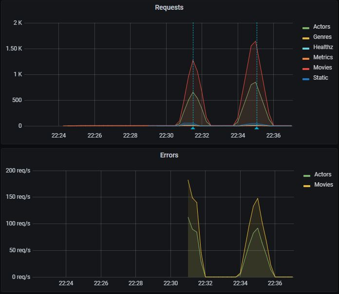

# Kubernetes in Codespaces

> Setup a Kubernetes cluster using `kind` running in [GitHub Codespaces](https://github.com/features/codespaces)


## Overview

We use this for `inner-loop` Kubernetes development. Note that it is not appropriate for production use but is a great `Developer Experience`. Feedback calls the approach `game-changing` - we hope you agree!

## Notes for the Hands-on Lab

We have over 300 people registered!!!

Please mute your Teams client unless you're asking a question.

Please turn your cameras off. While we love to see your smiling faces, we have a lot of people registered and this will save us a lot of bandwidth.

Please raise your hand or use the Teams chat to ask questions. We will have several team members available to answer questions. The presenters will pause after every step to address any issues or questions.

For ideas, feature requests, future sessions and any long-running discussion, please use GitHub discussions so we can collaborate and follow up.

We are on a tight schedule, so we may have to `table` discussions. We will use GitHub Discussions to follow up and setup follow-on sessions if there is enough interest in the topic. Please `up vote` and `react` to the discussion topics that are interesting to you.

We may have a surprise guest or two ... :)

This Codespace is tested with `zsh` and `oh-my-zsh` - it "should" work with bash but hasn't been fully tested. For the HoL, please use zsh to avoid any issues.

You can run the `dev container` locally and you can also connect to the Codespace with a local version of VS Code. For the HoL, please use GitHub Codespaces in your browser to avoid any issues.

You will have access after the event, so please experiment and add any issues to the GitHub Discussion. 

We LOVE PRs! (this is a downstream repo, so post in GitHub Discussions if you want to PR and we'll point you to the right repo and ensure access)

Enough of the `fine print` - let's hack!

## Shoutout for the "."

GitHub just released some pretty AWESOME new features including `"."` and `Codespaces`

Congratulations to the GitHub team on an amazing release!

HUGE shoutout and thank you to GitHub, DevDiv and 1ES for the amazing support over the last 18 months that got us to this point. Thank You! We literally couldn't have done this without you.

## Open with Codespaces

> Note this screen shot is a little out of date with the released version of Codespaces
>
> We LOVE PRs ... :)

- Click the `Code` button on your repo
- Click `Open with Codespaces`
- Click `New Codespace`
- Choose the `4 core` option
  - 2 core isn't enough to run everything well


## Open Workspace

> Important!
>
> Another late change - wait until the Codespace is ready before opening the workspace
>
> We LOVE PRs ... :)

- When prompted, choose `Open Workspace`

## Build and Deploy a Kind Cluster

  ```bash

  # build the cluster
  make all

  ```


## Validate Deployment

Output from `make all` should resemble this

```text

default      fluentb                                   1/1   Running   0   31s
default      jumpbox                                   1/1   Running   0   25s
default      webv                                      1/1   Running   0   31s
default      ngsa-memory                               1/1   Running   0   33s
monitoring   grafana-64f7dbcf96-cfmtd                  1/1   Running   0   32s
monitoring   prometheus-deployment-67cbf97f84-tjxm7    1/1   Running   0   32s

```

## Service endpoints

- All endpoints are usable in your browser via clicking on the `Ports` tab
  - Select the `open in browser icon` on the far right
- Some popup blockers block the new browser tab
- If you get a gateway error, just hit refresh - it will clear once the port-forward is ready

```bash

# check endpoints
make check

```

## Validate deployment with k9s

- From the Codespace terminal window, start `k9s`
  - Type `k9s` and press enter
  - Press `0` to select all namespaces
  - Wait for all pods to be in the `Running` state (look for the `STATUS` column)
  - Use the arrow key to select `nsga-memory` then press the `l` key to view logs from the pod
  - To go back, press the `esc` key
  - To view other deployed resources - press `shift + :` followed by the deployment type (e.g. `secret`, `services`, `deployment`, etc).
  - To exit - `:q <enter>`


### Other interesting endpoints

Open [curl.http](./curl.http)

> [curl.http](./curl.http) is used in conjuction with the Visual Studio Code [REST Client](https://marketplace.visualstudio.com/items?itemName=humao.rest-client) extension.
>
> When you open [curl.http](./curl.http), you should see a clickable `Send Request` text above each of the URLs


Clicking on `Send Request` should open a new panel in Visual Studio Code with the response from that request like so:


## Jump Box

A `jump box` pod is created so that you can execute commands `in the cluster`

- use the `kj` alias
  - `kubectl exec -it jumpbox -- bash -l`
    - note: -l causes a login and processes `.profile`
    - note: `sh -l` will work, but the results will not be displayed in the terminal due to a bug

- use the `kje` alias
  - `kubectl exec -it jumpbox --`
- example
  - run http against the ClusterIP
    - `kje http ngsa-memory:8080/version`

## View Prometheus Dashboard

- Click on the `ports` tab of the terminal window
- Click on the `open in browser icon` on the Prometheus port (30000)
- This will open Prometheus in a new browser tab

- From the Prometheus tab
  - Begin typing NgsaAppDuration_bucket in the `Expression` search
  - Click `Execute`
  - This will display the `histogram` that Grafana uses for the charts

## Launch Grafana Dashboard

- Grafana login info
  - admin
  - akdc-512

- Once `make all` completes successfully
  - Click on the `ports` tab of the terminal window
  - Click on the `open in browser icon` on the Grafana port (32000)
  - This will open Grafana in a new browser tab


## View Grafana Dashboard

- Click on `Home` at the top of the page
- From the dashboards page, click on `NGSA`


## Run a load test

```bash

# from Codespaces terminal

# run a baseline test (will generate warnings in Grafana)
make test

# run a 60 second load test
make load-test

```

- Switch to the Grafana brower tab
- The test will generate 400 / 404 results
- The requests metric will go from green to yellow to red as load increases
  - It may skip yellow
- As the test completes
  - The metric will go back to green (1.0)
  - The request graph will return to normal



## View Fluent Bit Logs

- Start `k9s` from the Codespace terminal
- Select `fluentb` and press `enter`
- Press `enter` again to see the logs
- Press `s` to Toggle AutoScroll
- Press `w` to Toggle Wrap
- Review logs that will be sent to Log Analytics when configured

## Build and deploy a local version of WebValidate

- Switch back to your Codespaces tab

```bash

# from Codespaces terminal

# make and deploy a local version of WebV to k8s
make webv

```

## Build and deploy a local version of ngsa-memory

- Switch back to your Codespaces tab

```bash

# from Codespaces terminal

# make and deploy a local version of ngsa-memory to k8s
make app

```

## Next Steps

> [Makefile](./Makefile) is a good place to start exploring

## dapr Lab

> make sure you are in the root of the repo

### Create and run a Web API app with dapr

Create a new dotnet webapi project

```bash

mkdir -p dapr-app
cd dapr-app
dotnet new webapi --no-https

```

Run the app with dapr

```bash

dapr run -a myapp -p 5000 -H 3500 -- dotnet run

```

Check the endpoints

- open `dapr.http`
  - click on the `dotnet app` `send request` link
  - click on the `dapr endpoint` `send request` link

Open Zipkin

- Click on the `Ports` tab
  - Open the `Zipkin` link
  - Click on `Run Query`
    - Explore the traces generated automatically with dapr

Stop the app by pressing `ctl-c`

Clean up

```bash

cd ..
rm -rf dapr-app

```

### Add dapr SDK to the weather app

> Changes to the app have already been made and are detailed below

- Open `.vscode/launch.json`
  - Added `.NET Core Launch (web) with Dapr` configuration
- Open `.vscode/task.json`
  - Added `daprd-debug` and `daprd-down` tasks
- Open `weather/weather.csproj`
  - Added `dapr.aspnetcore` package reference
- Open `weather/Startup.cs`
  - Injected dapr into the services
    - Line 29 `services.AddControllers().AddDapr()`
  - Added `Cloud Events`
    - Line 40 `app.UseCloudEvents()`
- Open `weather/Controllers/WeatherForecastController.cs`
  - `PostWeatherForecast` is a new function for `sending` pub-sub events
    - Added the `Dapr.Topic` attribute
    - Got the `daprClient` via Dependency Injection
    - Published the model to the `State Store`
  - `Get`
    - Added the `daprClient` via Dependency Injection
    - Retrieved the model from the `State Store`
  - Set a breakpoint on lines 30 and 38

### Run the dapr weather app

- Press `F5` to run
- Open `dapr.http`
  - Send a message via dapr
    - Click on `Send Request` under `post to dapr`
    - Click `continue` when you hit the breakpoint
    - 200 OK
  - Get the model from the `State Store`
    - Click on `Send Request` under `dapr endpoint`
    - Click `continue` when you hit the breakpoint
    - Verify the value from the POST request appears
  - Change the `temperatureC` value in POST request and repeat

## FAQ

- Why don't we use helm to deploy Kubernetes manifests?
  - The target audience for this repository is app developers who are beginning their Kubernetes journey so we chose simplicity for the Developer Experience.
  - In our daily work, we use Helm for deployments and it is installed in the `.devcontainer` should you want to use it.

### Engineering Docs

- Team Working [Agreement](.github/WorkingAgreement.md)
- Team [Engineering Practices](.github/EngineeringPractices.md)
- CSE Engineering Fundamentals [Playbook](https://github.com/Microsoft/code-with-engineering-playbook)

## How to file issues and get help  

This project uses GitHub Issues to track bugs and feature requests. Please search the existing issues before filing new issues to avoid duplicates. For new issues, file your bug or feature request as a new issue.

For help and questions about using this project, please open a GitHub issue.

## Contributing

This project welcomes contributions and suggestions.  Most contributions require you to agree to a Contributor License Agreement (CLA) declaring that you have the right to, and actually do, grant us the rights to use your contribution. For details, visit <https://cla.opensource.microsoft.com>

When you submit a pull request, a CLA bot will automatically determine whether you need to provide a CLA and decorate the PR appropriately (e.g., status check, comment). Simply follow the instructions provided by the bot. You will only need to do this once across all repos using our CLA.

This project has adopted the [Microsoft Open Source Code of Conduct](https://opensource.microsoft.com/codeofconduct/). For more information see the [Code of Conduct FAQ](https://opensource.microsoft.com/codeofconduct/faq/) or contact [opencode@microsoft.com](mailto:opencode@microsoft.com) with any additional questions or comments.

## Trademarks

This project may contain trademarks or logos for projects, products, or services.

Authorized use of Microsoft trademarks or logos is subject to and must follow [Microsoft's Trademark & Brand Guidelines](https://www.microsoft.com/en-us/legal/intellectualproperty/trademarks/usage/general).

Use of Microsoft trademarks or logos in modified versions of this project must not cause confusion or imply Microsoft sponsorship.

Any use of third-party trademarks or logos are subject to those third-party's policies.
